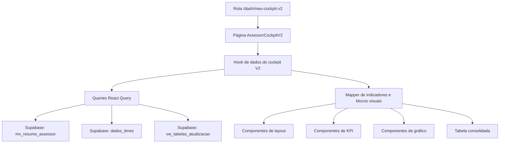
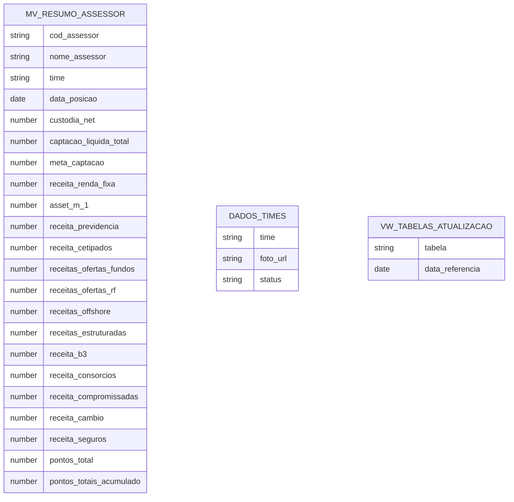

## 1. Desenho de Arquitetura



## 2. Descrição de Tecnologia
- Frontend: React 18 + TypeScript + Vite
- UI: Tailwind CSS + componentes `shadcn/ui`
- Estado remoto: `@tanstack/react-query`
- Gráficos: `recharts`
- Movimento: `framer-motion`
- Ícones: `lucide-react`
- Navegação: `react-router-dom`
- Dados: Supabase já existente no projeto
- Escopo inicial: sem backend adicional e sem novas tabelas obrigatórias

## 3. Definição de Rotas
| Rota | Objetivo |
|-------|---------|
| `/dash/meu-cockpit` | Cockpit legado já existente |
| `/dash/meu-cockpit-v2` | Nova experiência premium do cockpit individual |

## 4. Definições de Dados e Contratos

### 4.1 Fontes de Dados Existentes
| Fonte | Uso na V2 |
|------|-----------|
| `mv_resumo_assessor` | Base principal de indicadores, metas, receita, captação, custódia, ranking e identificação |
| `dados_times` | Catálogo de times ativos e ativos visuais do time |
| `vw_tabelas_atualizacao` | Data de atualização e referência da leitura |

### 4.2 Modelo de Leitura da Página
```ts
type CockpitV2Filters = {
  selectedYear: string;
  selectedMonth: string;
  selectedTeam: string;
  selectedAssessorCode: string;
  displayMode: "meta" | "proporcional" | "pace";
  referenceDate: Date;
};

type CockpitV2Hero = {
  assessorName: string;
  assessorCode: string;
  teamName: string;
  assessorPhoto?: string | null;
  selectedPeriodLabel: string;
};

type CockpitV2RankingSummary = {
  position: number | null;
  totalAssessors: number;
  points: number;
  year: string;
};

type CockpitV2TopMetric = {
  id: string;
  label: string;
  value: string;
  support: string;
  tone: "gold" | "green" | "blue" | "magenta" | "neutral";
};

type CockpitV2PerformanceBlock = {
  label: string;
  target: number;
  realized: number;
  percent: number;
  gap: number;
};

type CockpitV2ProductRow = {
  label: string;
  target: number;
  realized: number;
  percent: number;
  gap: number;
};

type CockpitV2ChartPoint = {
  monthKey: string;
  monthLabel: string;
  realized: number;
  target: number;
  gap: number;
};

type CockpitV2TableRow = {
  team: string;
  assessor: string;
  netClientes: number;
  metaCaptacao: number;
  captacaoLiquida: number;
  metaReceita: number;
  receitaTotal: number;
  receitaInvest: number;
  receitaCs: number;
  roaTotal?: number;
  roaInvest?: number;
  roaCs?: number;
  repasseTotal?: number;
};
```

### 4.3 Estratégia de Cálculo
- Reaproveitar os cálculos hoje feitos no cockpit legado para:
  - `performance global`
  - `investimentos`
  - `cross-sell`
  - `captação líquida`
  - `evolução da receita`
- Extrair esses cálculos do componente monolítico atual para um mapper ou hook dedicado.
- Manter diferenciação clara entre:
  - meta original
  - meta proporcional
  - projeção/pace
- Somente exibir na V2 os indicadores que tenham fórmula e fonte explícitas.

## 5. Estrutura Proposta de Arquivos
| Caminho | Finalidade |
|-------|------------|
| `src/pages/AssessorCockpitV2.tsx` | Página principal da V2 |
| `src/components/cockpit-v2/CockpitV2Shell.tsx` | Estrutura macro e grid |
| `src/components/cockpit-v2/CockpitV2Sidebar.tsx` | Navegação lateral compacta |
| `src/components/cockpit-v2/CockpitV2Header.tsx` | Header executivo da página |
| `src/components/cockpit-v2/CockpitV2AdvisorHero.tsx` | Bloco de identidade do assessor |
| `src/components/cockpit-v2/CockpitV2RankingStrip.tsx` | Faixa de Super Ranking |
| `src/components/cockpit-v2/CockpitV2KpiRail.tsx` | Faixa de KPIs rápidos |
| `src/components/cockpit-v2/CockpitV2PerformanceGauge.tsx` | Card de performance global |
| `src/components/cockpit-v2/CockpitV2MetricCard.tsx` | Card genérico de KPI analítico |
| `src/components/cockpit-v2/CockpitV2ProductTableCard.tsx` | Card com breakdown por produto |
| `src/components/cockpit-v2/CockpitV2CaptureCard.tsx` | Card de captação líquida |
| `src/components/cockpit-v2/CockpitV2RevenueEvolution.tsx` | Gráfico de evolução da receita |
| `src/components/cockpit-v2/CockpitV2CaptureAnalysis.tsx` | Gráfico de análise de captação |
| `src/components/cockpit-v2/CockpitV2IndicatorsTable.tsx` | Tabela final consolidada |
| `src/hooks/useAssessorCockpitV2Data.ts` | Orquestração de queries e composição dos dados |
| `src/utils/cockpit-v2-mappers.ts` | Transformação de dados brutos em blocos de UI |

## 6. Estratégia de Componentização
- Cada componente visual deve ter responsabilidade única.
- A página principal apenas:
  - resolve filtros
  - chama o hook de dados
  - organiza a composição dos blocos
- Toda transformação de dados deve sair do JSX da página.
- Componentes com tabelas e gráficos devem receber dados prontos, nunca regras de negócio pesadas.

## 7. Dependências Técnicas e Restrições
- Não usar importação dinâmica para a nova rota.
- Não substituir o cockpit atual nesta primeira fase.
- Não criar novas tabelas sem validação de necessidade real.
- Não inventar indicadores sem campo ou fórmula auditável.
- Manter compatibilidade com o sistema atual de autenticação e perfis.

## 8. Modelo de Permissões
- `user`: fixa o filtro no próprio código do assessor.
- `lider`: enxerga somente o time do líder e seus assessores.
- `admin` e `admin_master`: podem alternar time e assessor livremente.
- As regras já existentes no cockpit legado devem ser mantidas como referência funcional.

## 9. Estratégia de Implementação
- Fase 1: criar nova rota e shell visual.
- Fase 2: migrar filtros e contexto de acesso.
- Fase 3: extrair e validar cálculos herdados da V1.
- Fase 4: construir blocos visuais principais.
- Fase 5: implementar gráficos e tabela final.
- Fase 6: adicionar modais, exportação e refinamentos.
- Fase 7: validar responsividade, performance e consistência.

## 10. Modelo de Dados Lógico


## 11. Riscos Técnicos
- O anexo de referência sugere alguns indicadores que podem não existir prontos na base.
- `Ativações`, `fluxo de entrada`, `fluxo de saída`, `repasse` e alguns ROAs precisam validação explícita antes da UI final.
- Se algum bloco não tiver fonte auditável, a V2 deve trocar por um bloco confiável equivalente, sem “preencher espaço”.
