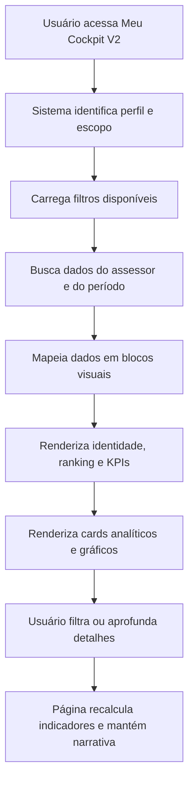

## 1. Visão Geral do Produto
O `Meu Cockpit V2` será uma nova versão da experiência de acompanhamento individual do assessor, criada em rota separada para não impactar o cockpit atual.
- O objetivo é consolidar em uma única tela a leitura de performance, produção, metas, evolução, mix de receita e ranking do assessor com visual premium, denso e intuitivo.
- O valor da solução é reduzir a navegação entre dashboards, acelerar leitura executiva e dar ao assessor uma visão clara de onde está performando bem, onde está abaixo e como evoluiu no período.

## 2. Funcionalidades Centrais

### 2.1 Perfis de Usuário
| Perfil | Forma de acesso | Permissões centrais |
|------|---------------------|------------------|
| Assessor | Login atual da aplicação | Visualiza o próprio cockpit por padrão |
| Líder | Login atual da aplicação | Visualiza time e pode filtrar assessores do próprio time |
| Admin | Login atual da aplicação | Visualiza qualquer time e qualquer assessor |
| Admin Master | Login atual da aplicação | Mesmo escopo do admin com governança total |

### 2.2 Módulos Funcionais
1. **Shell da página**: fundo imersivo, grid principal, sidebar compacta e header executivo.
2. **Bloco de identidade do assessor**: foto, nome, código, time, período e contexto da leitura.
3. **Faixa de Super Ranking**: posição no ranking anual, pontuação acumulada e comparação com pares.
4. **Faixa de KPIs rápidos**: clientes ativos, receita total, custódia, captação líquida, ativações e outros indicadores auditáveis.
5. **Performance global**: gauge central com meta, realizado e gap.
6. **Bloco de Investimentos**: percentual, meta, realizado, gap e breakdown por produto.
7. **Bloco de Cross-sell**: percentual, meta, realizado, gap e breakdown por produto.
8. **Bloco de Captação Líquida**: atingimento do objetivo mensal e leitura rápida do resultado.
9. **Gráficos analíticos**: evolução de receita, análise de captação e comparativos visuais.
10. **Tabela consolidada final**: visão detalhada dos indicadores do assessor no período, com possibilidade de exportação.
11. **Interações de aprofundamento**: tooltips, modais narrativos e detalhamento contextual por bloco.

### 2.3 Detalhamento da Página
| Nome da página | Nome do módulo | Descrição funcional |
|-----------|-------------|---------------------|
| Meu Cockpit V2 | Header executivo | Exibe título, filtros, período, ações e estado da visualização |
| Meu Cockpit V2 | Sidebar compacta | Atalhos internos por seção e identidade visual premium |
| Meu Cockpit V2 | Hero do assessor | Exibe foto, nome, código, time e contexto principal da leitura |
| Meu Cockpit V2 | Super Ranking | Mostra posição no ranking anual, pontos acumulados e status de destaque |
| Meu Cockpit V2 | KPIs rápidos | Exibe resumo de indicadores de topo com leitura imediata |
| Meu Cockpit V2 | Performance global | Resume a aderência do assessor à meta consolidada |
| Meu Cockpit V2 | Investimentos | Consolida receita e meta do eixo de investimentos com breakdown por produto |
| Meu Cockpit V2 | Cross-sell | Consolida receita e meta do eixo de cross-sell com breakdown por produto |
| Meu Cockpit V2 | Captação líquida | Mostra objetivo, realizado, percentual e leitura do mês |
| Meu Cockpit V2 | Evolução de receita | Exibe histórico mensal com meta e realizado |
| Meu Cockpit V2 | Análise de captação | Mostra a dinâmica mensal de captação conforme dados disponíveis |
| Meu Cockpit V2 | Tabela consolidada | Fecha a narrativa com indicadores detalhados em uma grade auditável |

## 3. Processo Central
O fluxo principal começa com o usuário acessando a rota nova da V2. A página carrega filtros, identifica o escopo do perfil e busca os dados consolidados do assessor e do período. Em seguida, transforma os dados brutos em blocos visuais separados por tema: identidade, ranking, KPIs, performance, mix e evolução. O usuário pode filtrar mês, ano, time e assessor, alternar entre leituras e aprofundar detalhes por interações locais sem sair da tela.

## 4. Design da Interface

### 4.1 Estilo Visual
- Direção estética: terminal executivo premium com atmosfera de mesa de controle, sem cara de template genérico.
- Cores principais: base escura azul petróleo e grafite, com acentos em dourado, verde, azul elétrico e magenta para hierarquia funcional.
- Botões e controles: compactos, sofisticados, com bordas suaves, brilho discreto e estados ativos muito claros.
- Tipografia: display marcante para números e manchetes; fonte técnica/condensada para labels, tabelas e microcopy.
- Layout: desktop-first, altamente modular, com zonas bem delimitadas e densidade controlada.
- Ícones: `lucide-react`, usados de forma contida e sem poluição visual.
- Movimento: transições suaves, animações de entrada pequenas, barras de progresso e hover states com sensação premium.

### 4.2 Visão de Design por Módulo
| Nome da página | Nome do módulo | Elementos de UI |
|-----------|-------------|-------------|
| Meu Cockpit V2 | Header executivo | filtros compactos, ações, chips de período, container escuro com leve brilho |
| Meu Cockpit V2 | Sidebar compacta | navegação vertical, ícones contidos, estados ativos iluminados |
| Meu Cockpit V2 | Hero do assessor | avatar grande, nome forte, código técnico, selo/contexto |
| Meu Cockpit V2 | Super Ranking | faixa horizontal premium com ícone, posição, pontos e camada visual de destaque |
| Meu Cockpit V2 | KPIs rápidos | cards pequenos com headline numérica, subtítulo e nota contextual |
| Meu Cockpit V2 | Performance global | gauge central, número dominante, trio meta/realizado/gap |
| Meu Cockpit V2 | Investimentos e Cross-sell | cards largos com percentual, barra de progresso e mini tabela |
| Meu Cockpit V2 | Captação líquida | card destaque com barra, objetivo, realizado e cor semântica |
| Meu Cockpit V2 | Gráficos | `Recharts` com tooltip customizado, legendas discretas e leitura clara |
| Meu Cockpit V2 | Tabela consolidada | cabeçalho sticky, cores semânticas, status visual e exportação |

### 4.3 Responsividade
- Estratégia desktop-first obrigatória.
- Desktop grande: layout completo com sidebar, faixa horizontal de KPIs e blocos lado a lado.
- Notebook: preserva estrutura principal com redução de densidade.
- Tablet: reorganiza grids em duas colunas e mantém scroll horizontal nas tabelas.
- Mobile: empilha blocos por prioridade, reduz microcopy e preserva leitura dos principais KPIs.

### 4.4 Princípios de Experiência
- A tela deve contar uma história visual: `quem é o assessor`, `como ele está no mês`, `onde está ganhando`, `onde está perdendo` e `como vem evoluindo`.
- Todo indicador exibido deve ter dado real, auditável e rastreável no código.
- Métricas duplicadas da referência visual devem ser consolidadas em uma única narrativa mais limpa.
- A V2 não deve substituir a V1 na primeira etapa; precisa coexistir para validação controlada.
